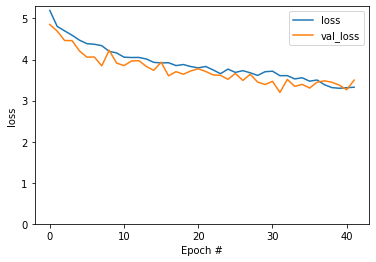

# Neural Image Captioning

An image-captioning project that combines a pretrained visual feature extractor with a trainable sequence decoder to generate natural-language descriptions of images. A second notebook extends the experiment with **Keras Tuner**.

## Workflow

- Download and prepare caption datasets.
- Extract image features with a pretrained CNN.
- Tokenize and embed caption text.
- Train an attention/decoder-based captioning model.
- Generate captions and evaluate outputs.
- Explore hyperparameter tuning in the Keras Tuner variant.

## Example output

## Run

A GPU-enabled runtime is strongly recommended. The notebooks download Flickr8k/GCC resources and pretrained TensorFlow components, so internet access is required. Main dependencies include TensorFlow, TensorFlow Hub/Text/Datasets, `einops`, NLTK, Hugging Face Datasets, and Keras Tuner.

> Audit change: a cell defining `Captioner.call` had leading indentation that makes it invalid as a standalone Jupyter cell. The audited copy removes that indentation in both captioning notebooks.
